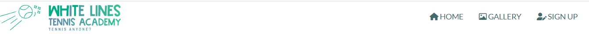
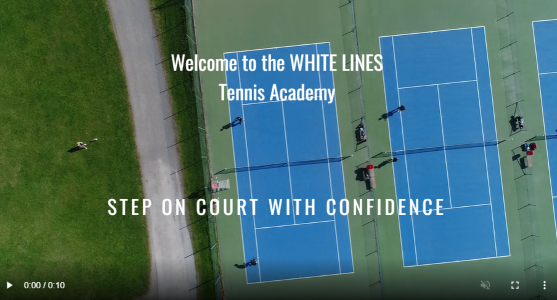
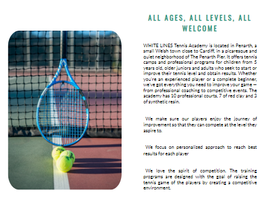
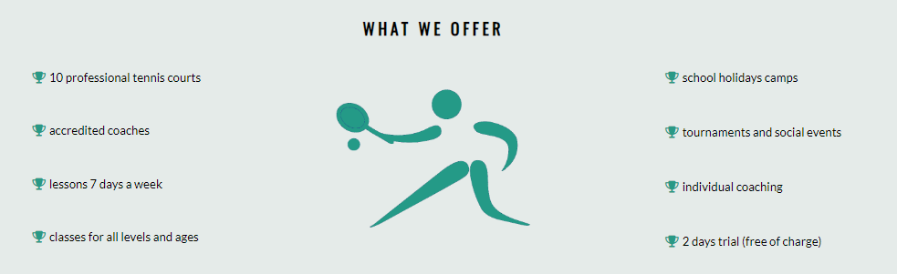
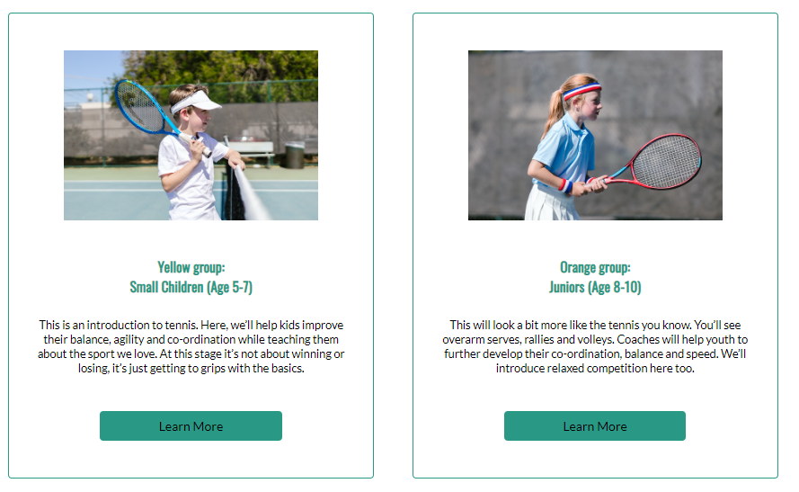

# WHITE LINES Tennis Academy

White Lines is a website which aim is to attract people of all ages and tennis abilities in Penarh and Cardiff area to pick up a tennis racquet and join the academy. Its hopes to adrress the parents to enroll their children for tennis lessons as well as adults who are just thinking of starting playing tennis as complete begginers or those who want to improve their tenis game. 

The website will be useful for aspiring tennis participants to find all information about the academy: 
what the tennis academy has to offer, what is its concept of culture, what tennis programmes they can sign up for and the reason why they should choose the White Lines. 

<!--  -->

## Features 

White Lines website consists of 3 webpages: 

- ### Home Page
It includes the introduction and the main information about the academy.
- ### Gallery
It shows pictures of the academy to present the venue and the sporting environment to tennis enthusiasts and potential cusomers. 
- ### Sign up 
This page encourages people interested in taking up tennis lessons to sign up to get more information and receive a tailored plan.  

### Existing Features

- __Header__

    Header consists of White Lines academy logo and navigation bar.
    Logo is a clickable picture that takes a user to the home page. 
    - Navigation bar includes links to Home page, Gallery and Sign Up page. It is identical, positioned at the top of each page, for easy navigation. This intuitive layout contributes to the user experience and allows users to access the information they want as quickly as possible.
    - Placing the navigation bar at the top of each page allows users to navigate from page to page without having to use the back button if they want to go back to the previous page.  

- __The landing video__

  - The landing includes a video of the tennis academy showing the venue's tennis courts from the bird's perspective. 
  The aim of this section is to grab users attention and to make them experience the atmosphere of the place. 
  - Text overlay has a welcome message with an encouraging slogan to attract the user and create a user's positive experience. 
<!--  -->

- __About Academy__

The About Academy section introduces the academy to the potential customer. It contains general information about who is the academy for, where the potential customer can find the venue and what is its main goal.
<!--  -->

- __Offer section__

The offer section is very important part of the website. It shows what the White Lines provide for tennis enthusists and what make them better than their competitors.It is the selling part of the website and its purpose is to convince potential customers to sign up for lessons by presenting the academy as professional place that has a lot to offer. 
<!--  -->

- __Tennis Programmes__ 
This section inroduces various programmes that the academy runs. It gives the users an initial idea about who is the programme for and what is it focused on. It gives the user the oportunity to specify what programme is the most suitable from them. Each programme box has a button 'Learn more' which is supposed to thake them to the site where they can get more specific information about that particular programme yet  this is the feature to implement. 
Underneath the tennis programmes is JOIN US TODAY button to prompt the user to buy tennis lesson. The link will direct the user to the SIGN UP page to register and join the academy. 
<!--  -->

- __Testimonials__

  The most important part of the website. The reason for this is testimonials give potential customers that one final push to sign up for the service. They are the most effective type of content to put on a website to get more sales.
  The testimonials have been specifically designed to show the good side of the academy by saying positive things about the tennis place, lessons and coaches. Excellent comments from the current or previous customers will reassure people browsing the website that this is a great place to learn tennis skills. 
<!--  -->

- __Contact Details__
Contact details section - here users can find information about the location, opening hours, email address and phone number. Contact details are easily to find; they are well structured and have a background color to underline the importance of this section. 

- __The Footer__

<!-- - The footer section includes links to the relevant social media sites for Love Running. The links will open to a new tab to allow easy navigation for the user. 
  - The footer is valuable to the user as it encourages them to keep connected via social media

 -->

- __Gallery__

  <!-- - The gallery will provide the user with supporting images to see what the meet ups look like. 
  - This section is valuable to the user as they will be able to easily identify the types of events the organisation puts together.--> 

 -->

- __The Sign Up Page__

  - This page will allow the user to get signed up to Love Running to start their running journey with the community. The user will be able specify if they would like to take part in road, trail or both types of running. The user will be asked to submit their full name and email address. 

For some/all of your features, you may choose to reference the specific project files that implement them.

In addition, you may also use this section to discuss plans for additional features to be implemented in the future:

### Features Left to Implement

- Creating additional pages for each programme to which users will be taken if they click on Find out button in the programme boxes. They will contain specific information about each programme e.g what the programme consists from, timetable, prices, etc.

- Another feature idea

## Testing 

In this section, you need to convince the assessor that you have conducted enough testing to legitimately believe that the site works well. Essentially, in this part you will want to go over all of your project’s features and ensure that they all work as intended, with the project providing an easy and straightforward way for the users to achieve their goals.

In addition, you should mention in this section how your project looks and works on different browsers and screen sizes.

You should also mention in this section any interesting bugs or problems you discovered during your testing, even if you haven't addressed them yet.

If this section grows too long, you may want to split it off into a separate file and link to it from here.

### Validator Testing 

- HTML
  - No errors were returned when passing through the official [W3C validator](https://validator.w3.org/nu/?doc=https%3A%2F%2Fcode-institute-org.github.io%2Flove-running-2.0%2Findex.html)
- CSS
  - No errors were found when passing through the official [(Jigsaw) validator](https://jigsaw.w3.org/css-validator/validator?uri=https%3A%2F%2Fvalidator.w3.org%2Fnu%2F%3Fdoc%3Dhttps%253A%252F%252Fcode-institute-org.github.io%252Flove-running-2.0%252Findex.html&profile=css3svg&usermedium=all&warning=1&vextwarning=&lang=en#css)

### Unfixed Bugs

You will need to mention unfixed bugs and why they were not fixed. This section should include shortcomings of the frameworks or technologies used. Although time can be a big variable to consider, paucity of time and difficulty understanding implementation is not a valid reason to leave bugs unfixed. 

## Deployment

This section should describe the process you went through to deploy the project to a hosting platform (e.g. GitHub) 

- The site was deployed to GitHub pages. The steps to deploy are as follows: 
  - In the GitHub repository, navigate to the Settings tab 
  - From the source section drop-down menu, select the Master Branch
  - Once the master branch has been selected, the page will be automatically refreshed with a detailed ribbon display to indicate the successful deployment. 

The live link can be found here - https://code-institute-org.github.io/love-running-2.0/index.html 

## Credits 

In this section you need to reference where you got your content, media and extra help from. It is common practice to use code from other repositories and tutorials, however, it is important to be very specific about these sources to avoid plagiarism. 

You can break the credits section up into Content and Media, depending on what you have included in your project. 

### Content 

- The text for the Home page was taken from Wikipedia Article A
- Instructions on how to implement form validation on the Sign Up page was taken from [Specific YouTube Tutorial](https://www.youtube.com/)
- The icons in the footer were taken from [Font Awesome](https://fontawesome.com/)

### Media

tennis-gallery-5.png 
 
https://images.unsplash.com/photo-1573294184805-e3044b161ace?ixlib=rb-1.2.1&ixid=MnwxMjA3fDB8MHxwaG90by1wYWdlfHx8fGVufDB8fHx8&auto=format&fit=crop&w=774&q=80
 
Photo by 傅甬 华: https://unsplash.com/photos/q9iVyHxn230

img52.png
 
https://www.pexels.com/photo/girl-wearing-sportswear-standing-by-the-tennis-net-8224498/
 
Photo by RODNAE Productions

img53.png 
 
https://www.pexels.com/photo/girl-playing-tennis-8224723/)
 
Photo by RODNAE Productions

[Picture1](https://images.unsplash.com/photo-1573294184805-e3044b161ace?ixlib=rb-1.2.1&ixid=MnwxMjA3fDB8MHxwaG90by1wYWdlfHx8fGVufDB8fHx8&auto=format&fit=crop&w=774&q=80)

[https://images.unsplash.com/photo-1573294184805-e3044b161ace?ixlib=rb-1.2.1&ixid=MnwxMjA3fDB8MHxwaG90by1wYWdlfHx8fGVufDB8fHx8&auto=format&fit=crop&w=774&q=80

- The photos used on the home and sign up page are from This Open Source site
- The images used for the gallery page were taken from this other open source site

Congratulations on completing your Readme, you have made another big stride in the direction of being a developer! 

## Other General Project Advice

Below you will find a couple of extra tips that may be helpful when completing your project. Remember that each of these projects will become part of your final portfolio so it’s important to allow enough time to showcase your best work! 

- One of the most basic elements of keeping a healthy commit history is with the commit message. When getting started with your project, read through [this article](https://chris.beams.io/posts/git-commit/) by Chris Beams on How to Write  a Git Commit Message 
  - Make sure to keep the messages in the imperative mood 

- When naming the files in your project directory, make sure to consider meaningful naming of files, point to specific names and sections of content.
  - For example, instead of naming an image used ‘image1.png’ consider naming it ‘landing_page_img.png’. This will ensure that there are clear file paths kept. 

- Do some extra research on good and bad coding practices, there are a handful of useful articles to read, consider reviewing the following list when getting started:
  - [Writing Your Best Code](https://learn.shayhowe.com/html-css/writing-your-best-code/)
  - [HTML & CSS Coding Best Practices](https://medium.com/@inceptiondj.info/html-css-coding-best-practice-fadb9870a00f)
  - [Google HTML/CSS Style Guide](https://google.github.io/styleguide/htmlcssguide.html#General)

Getting started with your Portfolio Projects can be daunting, planning your project can make it a lot easier to tackle, take small steps to reach the final outcome and enjoy the process! 