# WHITE LINES Tennis Academy

The website White Lines was developed with the goal of attracting people of all ages and tennis abilities in the Penarth and Cardiff areas to pick up a tennis racquet and join our academy. 
It hopes to engage parents to enroll their children in tennis lessons as well as adults who are just thinking of starting to play tennis as complete beginners or those who are looking for ways to improve their game.

This website will be helpful to aspiring tennis players in order to find out all the information on the academy: what the White Lines has to offer, what its culture is like, what tennis programmes are offered, and why they should sign up.

## Features 

There are three webpages on the White Lines website: 

  - ### Home Page
  This page provides an introduction and basic information about the academy. 
  - ### Gallery
  It displays pictures of the academy and the sporting environment to attract tennis enthusiasts and potential customers. 
  - ### Sign up 
  The purpose of this page is to encourage people interested in taking up tennis lessons to sign up to receive more information and a personalised lesson plan.  

### Existing Features

- __Header__
  - White Lines Academy's logo and navigation bar are featured in the header.
  - A logo links a user to the home page when clicked.
  - Navigation bar includes links to Home page, Gallery and Sign Up page. It is identical, positioned 
    at the top of each page, for easy navigation. 
    This intuitive layout enhances the user experience and gives users access to the information they want as quickly as possible.
    Placing the navigation bar at the top of each page allows users to navigate from page to page 
    without having to use the back button if they wish to return to the previous page.
      
    

      
    

- __The landing video__
  - The landing includes a video from the tennis academy showing the site's tennis courts from a 
    bird's-eye perspective. 
    The purpose of this section is to capture the attention of users and let them discover the atmosphere of the place.
  - The overlay contains a welcome message with an encouraging slogan to appeal to the user and create a
     positive user experience.
      
    

      
    

     

- __About Academy__
  - The About Academy section presents the academy to the website visitor. It contains general
    information on who the academy is for, where the prospective customer can find the place and main objectives of the academy.
      
    

      
    

- __Offer section__
  - The offer section is an important part of the site. It shows what White Lines provide to tennis buffs and what 
    makes them better than their competitors. It is a selling part of the website and its goal is to convince prospective clients to register for courses by presenting the academy as a professional venue that has much to offer.
      
    

      
    

     

- __Tennis Programmes__ 
  - This section presents the tennis courses of the academy. It gives users an early sense of who are
    the programmes for and what they focuse on. It provides the user with the opportunity to specify which program is most suitable for them. Each program box has a 'Learn More' button that is supposed to bring visitors to the website where they can get more specific information about that particular program.
  - Below the tennis programs is the JOIN US TODAY button to encourage the user to purchase a tennis
    class. This link will bring the user to the Sign Up page to register for the Academy.
      
    

      
    

     

- __Testimonials__
  - The most important part of the website. The reason for this is testimonials give potential
    customers that one final push to sign up for the service. They are the most effective type of content to put on a website to get more sales.
  - The testimonials have been specifically designed to show the good side of the academy by saying 
    positive things on the tennis place, lessons and coaches. Great feedback from current or former customers will reassure those browsing the website that this is a great place to learn tennis skills.
      
    

      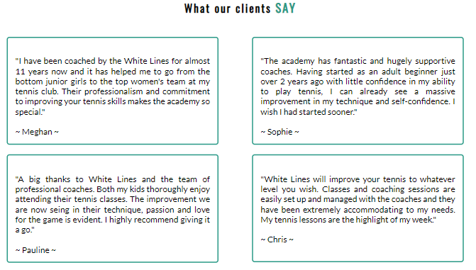
    

     

- __Contact Details__
  - Contact Information Section - here users can find information about location, opening hours, e-mail
    address and telephone number. Contact details are easy to find; they are well structured and have a background colour to emphasize the importance of the section.
      
    

      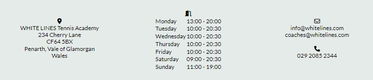
    

     

- __The Footer__
  - The footer area contains links to White Lines' social media sites. Links are opened in a new tab to
    make it easier to navigate. Social media integration gives users more ways to engage and interact with the academy. 
    They also create more opportunities to promote the service of the academy and build a larger customer base.
    Social media links are valuable for the user because they can obtain up-to-date information on academy activities, special events or various tennis practices.
  - Footer also includes links to major tennis slams. It allows tennis enthusiasts to follow the world's
    top tennis players and enhance their motivation.
    Similarly to the header, the footer remains the same regardless of the webpage a visitor browses. 
    This intuitive layout contributes to the users experience.
      
    

      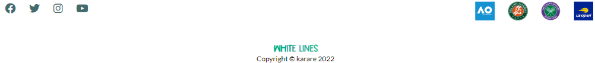
    

     

- __Gallery__
    - The gallery provides the user with supportive images of what life in the academy looks like. This section is
      designed to capture the attention of visitors and improve the user experience of the website. This section is valuable to users because they can identify the tennis experience they can gain and learn more about the tennis venue and its atmosphere.
      /
    

      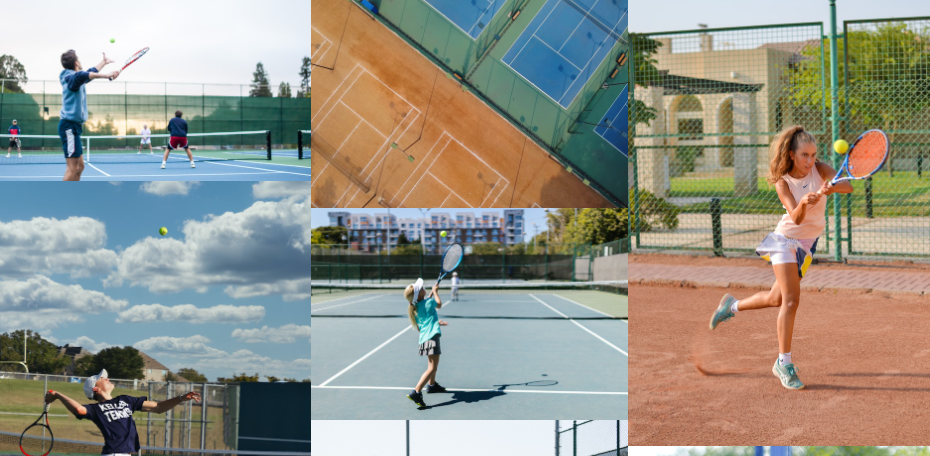
    

     

- __The Sign Up Page__
  - This page will allow the user to get signed up to White Lines to begin their tennis journey. The user will 
    be able to create a White Lines Tennis academy account and specify the programme in which they are interested. The user will also be prompted to submit their full name, e-mail address and phone number.
      
    

      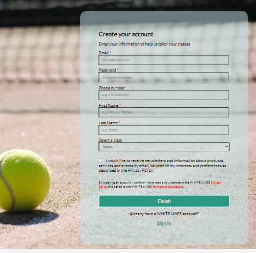
    

     

### Features Left to Implement

  - Create additional pages for each program in order to provide the visitors with additional information, 
    i.e. what the program consists of, the description of extra activities, schedules and prices.
    When the user clicks on 'Learn More' button in the programme block they will be taken to the specific page.

  - Another idea is to create an academy news page that will be updated regularly with special events,
    activities, student achievements and other interesting ideas.

### Wireframes 
- [Home Desktop](wireframes/home-desktop.png)
- [Home Tablet](wireframes/home-tablet.png)
- [Home Mobile](wireframes/home-mobile.png)
- [Gallery Desktop](wireframes/gallery-desktop.png)
- [Gallery Tablet](wireframes/gallery-tablet.png)
- [Gallery Mobile](wireframes/gallery-mobile.png)
- [Sign Up Desktop](wireframes/sign-up-desktop.png)
- [Sign Up Tablet](wireframes/sign-up-tablet.png)
- [Sign Up Mobile](wireframes/sign-up-mobile.png)
  

## Testing 

### Validator Testing 

- HTML
  - No errors were returned when passing through the official [W3C validator](https://validator.w3.org/nu/?doc=https%3A%2F%2Fkarare1.github.io%2Fwhite-lines%2F)
- CSS
  - Two syntax errors were found when passing through the official Jigsaw validator - a comma used instead of a semi-colon and font:size instead of font-size - both errors have been corrected. [(Jigsaw) validator](https://jigsaw.w3.org/css-validator/validator?uri=https%3A%2F%2Fkarare1.github.io%2Fwhite-lines%2F&profile=css3svg&usermedium=all&warning=1&vextwarning=&lang=en)

- Lighthouse report:   
  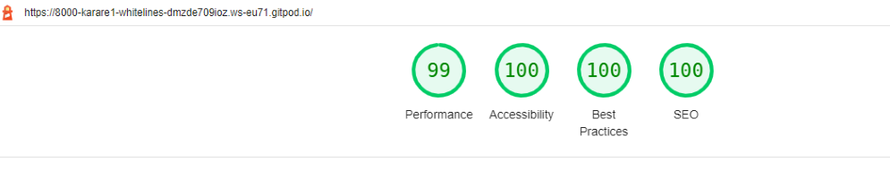

- Further testing has been done with Chrome DevTools, making sure that responsiveness works correctly on all devices. 
  After the deployment, I tested the site link focusing on the homepage, especially on the navigation bar in the header and whether the video in the homepage loads properly. 
  I also checked the form on the registration page to ensure that the validation is working properly and that no issues were detected.

- The website was assessed in various browsers: Mozilla Firefox, Google Chrome and Microsoft Edge.
  Live link was tested on Huawei P30, Samsung A50 to test smaller screen sizes, on a small display laptop - HP ProBook 430 and also on a larger display laptop - Dell Latitute 5580. 
  Each of the pages functioned well, but there is still room for improvement in terms of responsiveness and positioning of the elements on the website.

### Unfixed Bugs
None I am aware of. 

## Deployment

Deployment To GitHub Pages:   

1. Create a repository in GitHub   
  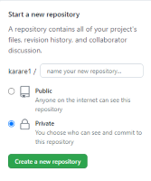  

2. Create the entry file for a site. GitHub Pages will look for an index.html as the entry file for the site   

3. Git push all contents from Integrated Development Environment (IDE) into GitHub  

4. On GitHub page, click on the site's repository on the left sidebar or alternatively click on the avatar icon and 
   then 'Your repositories'   
   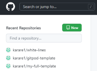 &nbsp; &nbsp; &nbsp; &nbsp; 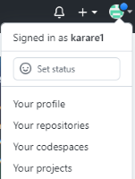  

5. In the repository, under the repository name (e.g. karare1/white-lines), click Settings    
  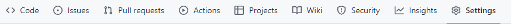  

6. In the "Code and automation" section on the left sidebar, click on Pages    
  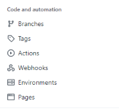  

7. From the source section drop-down menu, select 'Deploy from a Branch'   
   From the branch section drop-down menu, select 'main' and 'root' and then click on Save button    
     

8. The link to the site will be automatically created.  
   To see the published site, under "GitHub Pages", click the site's URL    
  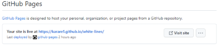  

   The live link can be found here: https://karare1.github.io/white-lines/  

## Technologies Used 
- [HTML](https://en.wikipedia.org/wiki/HTML)
- [CSS](https://en.wikipedia.org/wiki/CSS)

Also made use of:
- [Font Awesome](https://fontawesome.com/)
- [Google Fonts](https://fonts.google.com/)
- [HTML Validator](https://validator.w3.org/)
- [CSS Validator](https://jigsaw.w3.org/css-validator/)
- [Chrome DevTools](https://developer.chrome.com/docs/devtools/open/)
- [Balsamiq](https://en.wikipedia.org/wiki/Balsamiq)

## Credits 

### Content 

- The text for the Home page was taken from:   
  [www.vilastennisacademy.com](https://vilastennisacademy.com/2022/vilas-tennis-academy-academia-de-tenis-en-mallorca/)   
  [www.lta.org.uk](https://www.lta.org.uk/play/parents-area/youth-programme/)   
  [www.downthelinetennis.co.uk](https://www.downthelinetennis.co.uk/testimonials-down-the-line-tennis-academy)   
  [www.helenricetennis.com.au](https://www.helenricetennis.com.au/)

- The icons in the footer were taken from [Font Awesome](https://fontawesome.com/)
- Grandslam pictures:  
  Australian Open, Roland Garros and Wimbledon pictures were taken from Wikipedia.   
  US open picture from:
  [US Open logo](https://www.google.com/url?sa=i&url=https%3A%2F%2Fencrypted-tbn0.gstatic.com%2Fimages%3Fq%3Dtbn%3AANd9GcS4hwD1lwf3fYFSyZU9IDJSRd8JOKlkpOEIyesDMqHKvmbFvKRb&psig=AOvVaw0jLHDk55VwAtAsXAEVLB2_&ust=1665698857999000&source=images&cd=vfe&ved=0CAkQjhxqFwoTCNCyr_fZ2_oCFQAAAAAdAAAAABAD)

### Media

- Logo1 and Logo2 created on:  [www.smashinglogo.com](https://smashinglogo.com/en/)

- Video used on the Home Page: [Video](https://pixabay.com/videos/tennis-court-tennis-sports-overhead-35265/)  
  Video by VReel.co Stock Drone Video Platform from Pixabay 

- Images used on the home and sign up page:   
  [img1.png](https://unsplash.com/photos/POMeFvO3CwE)   
  Photo by Cristina Anne Costello on Unsplash   
  [img2.png](https://pixabay.com/vectors/tennis-racket-game-sports-net-304408/)  
  Image by Clker-Free-Vector-Images from Pixabay 
  (color changed using an image editor)   
  [img3.png](https://www.pexels.com/photo/boy-wearing-sportswear-standing-by-the-tennis-net-8223947/)   
  Photo by RODNAE Productions  
  [img4.png](https://www.pexels.com/photo/girl-playing-tennis-8224723/)   
  Photo by RODNAE Productions   
  [img5.png](https://www.pexels.com/photo/girl-wearing-sportswear-standing-by-the-tennis-net-8224498/)  
  Photo by RODNAE Productions   
  [img6.png](https://unsplash.com/photos/l3sIOhf9R3U)   
  Photo by Braden Egli on Unsplash  
  [img7.png](https://www.pexels.com/photo/woman-playing-tennis-on-court-2440324/)   
  Photo by Lukáš Dlutko   
  [img8.png](https://www.pexels.com/photo/tennis-player-holding-a-racket-10340627/)   
  Photo by cottonbro  
  background image:  
  [img9.png](https://pxhere.com/en/photo/1189774)  
  Photo by form PxHere

- Images used on the gallery page:   
  [tennis-gallery-1.png](https://unsplash.com/photos/Z4Sxy1_3wdY)   
  Photo by Julian Schiemann on Unsplash  
  [tennis-gallery-2.png](https://unsplash.com/photos/k_H7OSg_fUs)   
  Photo by Braden Egli on Unsplash   
  [tennis-gallery-3.png](https://unsplash.com/photos/oDlLU_1hZwM)  
  Photo by Richard Sagredo on Unsplash   
  [tennis-gallery-4.png](https://unsplash.com/photos/GQmYqY2ySLg)  
  Photo by Guzmán Barquín on Unsplash   
  [tennis-gallery-5.png](https://unsplash.com/photos/q9iVyHxn230)  
  Photo by 傅甬 华   
  [tennis-gallery-6.png](https://www.pexels.com/photo/girl-playing-tennis-8224672/)  
  Photo by RODNAE Productions  
  [tennis-gallery-7.png](https://www.pexels.com/photo/boy-playing-tennis-8224717/)  
  Photo by RODNAE Productions  
  [tennis-gallery-8.png](https://www.pexels.com/photo/girl-playing-tennis-8224683/)   
   Photo by RODNAE Productions   
  [tennis-gallery-9.png](https://www.pexels.com/photo/girl-playing-tennis-8224424/)   
  Photo by RODNAE Productions  
  [tennis-gallery-10.png](https://www.pexels.com/photo/sporty-female-playing-tennis-on-court-5409085/)   
  Photo by Mo Saeed   
  [tennis-gallery-11.png](https://www.pexels.com/photo/focused-tennis-player-hitting-ball-5067824/)   
  Photo by Anna Shvets   
  [tennis-gallery-12.png](https://www.pexels.com/photo/a-woman-in-black-top-and-white-skirt-playing-tennis-8652578/)   
  Photo by Dre Dawkcide