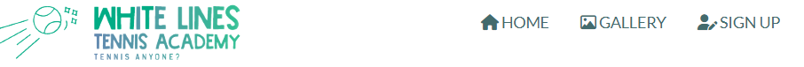

# WHITE LINES Tennis Academy

The website White Lines was developed with the goal of attracting people of all ages and tennis abilities in the Penarth and Cardiff areas to pick up a tennis racquet and join our academy. 
It hopes to engage parents to enroll their children in tennis lessons as well as adults who are just thinking of starting to play tennis as complete beginners or those who are looking for ways to improve their game.

This website will be helpful to aspiring tennis players in order to find out all the information on the academy: what the White Lines has to offer, what its culture is like, what tennis programmes are offered, and why they should sign up.

<!--  -->

## Features 

There are three webpages on the White Lines website: 

  - ### Home Page
  This page provides an introduction and basic information about the academy. 
  - ### Gallery
  It displays pictures of the academy and the sporting environment to attract tennis enthusiasts and potential customers. 
  - ### Sign up 
  The purpose of this page is to encourage people interested in taking up tennis lessons to sign up to receive more information and a personalised lesson plan.  

### Existing Features

- __Header__
    White Lines Academy's logo and navigation bar are featured in the header.
  - A logo links a user to the home page when clicked.
  - Navigation bar includes links to Home page, Gallery and Sign Up page. It is identical, positioned 
    at the top of each page, for easy navigation. 
    This intuitive layout enhances the user experience and gives users access to the information they want as quickly as possible.
    Placing the navigation bar at the top of each page allows users to navigate from page to page 
    without having to use the back button if they wish to return to the previous page.
    

      
    

- __The landing video__
  - The landing includes a video from the tennis academy showing the site's tennis courts from a 
    bird's-eye perspective. 
    The purpose of this section is to capture the attention of users and let them discover the atmosphere of the place.
  - The overlay contains a welcome message with an encouraging slogan to appeal to the user and create a
     positive user experience.
      
    

      
    

     

- __About Academy__
  - The About Academy section presents the academy to the website visitor. It contains general
    information on who the academy is for, where the prospective customer can find the place and main objectives of the academy.
      
    

      
    

- __Offer section__
  The offer section is an important part of the site. It shows what White Lines provide to tennis buffs and what makes them better than their competitors.It is a selling part of the website and its goal is to convince prospective clients to register for courses by presenting the academy as a professional venue that has much to offer.
    
    

      
    

   

- __Tennis Programmes__ 
  - This section presents the tennis courses of the academy. It gives users an early sense of who are
     the programmes for and what they focuse on. It provides the user with the opportunity to specify which program is most suitable for them. Each program box has a 'Learn More' button that is supposed to bring visitors to the website where they can get more specific information about that particular program.
  - Below the tennis programs is the JOIN US TODAY button to encourage the user to purchase a tennis
    class. This link will bring the user to the Sign Up page to register for the Academy.
      
    

      
    

     

- __Testimonials__
  - The most important part of the website. The reason for this is testimonials give potential
    customers that one final push to sign up for the service. They are the most effective type of content to put on a website to get more sales.
  - The testimonials have been specifically designed to show the good side of the academy by saying 
    positive things on the tennis place, lessons and coaches. Great feedback from current or former customers will reassure those browsing the website that this is a great place to learn tennis skills.

<!--  -->

- __Contact Details__
  - Contact Information Section - here users can find information about location, opening hours,e-mail
     address and telephone number. Contact details are easy to find; they are well structured and have a background colour to emphasize the importance of the section.

- __The Footer__
  - The footer area contains links to White Lines' social media sites. Links are opened in a new tab to
    make it easier to navigate. Social media integration gives users more ways to engage and interact with the academy. 
    They also create more opportunities to promote the service of the academy and build a larger customer base.
    Social media links are valuable for the user because they can obtain up-to-date information on academy activities, special events or various tennis practices.
  - Footer also includes links to major tennis slams. It allows tennis enthusiasts to follow the world's
    top tennis players and enhance their motivation.
    The same as the header, the footer remains the same regardless of the webpage a visitor browses. 
    This intuitive layout contributes to the users experience.

<!--  --> 

- __Gallery__

    The gallery provides the user with supportive images of what life in the academy looks like. This section is designed to capture the attention of visitors and improve the user experience of the website. This section is valuable to users because they can identify the tennis experience they can gain and learn more about the tennis venue and its atmosphere.
    
    
<!--  -->

- __The Sign Up Page__

- This page will allow the user to get signed up to White Lines to begin their tennis journey.The user will 
  be able to create a White Lines Tennis academy account and specify the programme in which they are interested. The user will also be prompted to submit their full name, e-mail address and date of birth.

<!--  -->

<!-- For some/all of your features, you may choose to reference the specific project files that implement them.

In addition, you may also use this section to discuss plans for additional features to be implemented in the future: -->

### Features Left to Implement

  - Create additional pages for each program in order to provide the visitors with additional information, 
    i.e. what the program consists of, the description of extra activities, schedules and prices.
    When the user clicks on 'Learn More' button in the programme block they will be taken to the specific page.

  - Another idea is to create an academy news page that will be updated regularly with special events,
    activities, student achievements and other interesting ideas.

## Testing 

<!-- In this section, you need to convince the assessor that you have conducted enough testing to legitimately believe that the site works well. Essentially, in this part you will want to go over all of your project’s features and ensure that they all work as intended, with the project providing an easy and straightforward way for the users to achieve their goals.

In addition, you should mention in this section how your project looks and works on different browsers and screen sizes.

You should also mention in this section any interesting bugs or problems you discovered during your testing, even if you haven't addressed them yet.

If this section grows too long, you may want to split it off into a separate file and link to it from here. -->

### Validator Testing 

- HTML
  - No errors were returned when passing through the official [W3C validator](https://validator.w3.org/nu/?doc=https%3A%2F%2Fkarare1.github.io%2Fwhite-lines%2F)
- CSS
  - Two syntax errors were found when passing through the official Jigsaw validator - a comma used instead of a semi-colon and font:size instead of font-size - both errors have been corrected. [(Jigsaw) validator](https://jigsaw.w3.org/css-validator/validator?uri=https%3A%2F%2Fkarare1.github.io%2Fwhite-lines%2F&profile=css3svg&usermedium=all&warning=1&vextwarning=&lang=en)

- Lighthouse report: 
   
  

Other testing was done with Chrome DevTools, making sure responsiveness works correctly across devices. 
After deployment, I have tested the site's link putting emphasis on the home page, particulary on nav bar in header and the if the video loads correctly. I have tested the live link on Huawei P30, Samsung A50 to test smaller screens sizes and also on small display laptop - HP ProBook 430. Each of the pages worked well but there is room for improvement when it comes to responsiveness and positioning of elements on the site.

### Unfixed Bugs

<!-- You will need to mention unfixed bugs and why they were not fixed. This section should include shortcomings of the frameworks or technologies used. Although time can be a big variable to consider, paucity of time and difficulty understanding implementation is not a valid reason to leave bugs unfixed.  -->

## Deployment

Deployment To GitHub Pages:

   

1. Create a repository in GitHub 
  

  

  

2. Create the entry file for a site. GitHub Pages will look for an index.html as the entry file for the site
 
3. Git push all contents from Integrated Development Environment (IDE) into GitHub 
 

3. On GitHub page, click on the site's repository on the left sidebar or alternatively click on the avatar icon and then 'Your repositories'
 

 &nbsp; &nbsp; &nbsp; &nbsp; 

 

4. In the repository, under the repository name (e.g. karare1/white-lines), click Settings.
 

 

5. In the "Code and automation" section of the left sidebar, click on Pages.
 

6. From the source section drop-down menu, select 'Deploy from a Branch'
   From the branch section drop-down menu, select 'main' and 'root' and then click on Save button.
    

   

7. The link to the site will be automatically created. 
   To see the published site, under "GitHub Pages", click the site's URL.
    

   
The live link can be found here: https://karare1.github.io/white-lines/

## Technologies Used 
- [HTML](https://en.wikipedia.org/wiki/HTML)
- [CSS](https://en.wikipedia.org/wiki/CSS)

Also made use of:
- [Font Awesome](https://fontawesome.com/)
- [Google Fonts](https://fonts.google.com/)
- [HTML Validator](https://validator.w3.org/)
- [CSS Validator](https://jigsaw.w3.org/css-validator/)
- [Chrome DevTools](https://developer.chrome.com/docs/devtools/open/)

## Credits 

In this section you need to reference where you got your content, media and extra help from. It is common practice to use code from other repositories and tutorials, however, it is important to be very specific about these sources to avoid plagiarism. 

You can break the credits section up into Content and Media, depending on what you have included in your project. 

### Content 

- The text for the Home page was taken from:
   
  https://vilastennisacademy.com/2022/vilas-tennis-academy-academia-de-tenis-en-mallorca/
   
  https://www.lta.org.uk/play/parents-area/youth-programme/
   
  https://www.downthelinetennis.co.uk/testimonials-down-the-line-tennis-academy
   
  https://www.helenricetennis.com.au/

- The icons in the footer were taken from [Font Awesome](https://fontawesome.com/)
- Grandslam pictures: 
   
  Australian Open, Roland Garros and Wimbledon pictures were taken from Wikipedia.
   
  US open picture: 
   
  https://www.google.com/url?sa=i&url=https%3A%2F%2Fencrypted-tbn0.gstatic.com%2Fimages%3Fq%3Dtbn%3AANd9GcS4hwD1lwf3fYFSyZU9IDJSRd8JOKlkpOEIyesDMqHKvmbFvKRb&psig=AOvVaw0jLHDk55VwAtAsXAEVLB2_&ust=1665698857999000&source=images&cd=vfe&ved=0CAkQjhxqFwoTCNCyr_fZ2_oCFQAAAAAdAAAAABAD

### Media

Logo1 and Logo2 created on: 
 https://smashinglogo.com/en/

video:
  
Video by VReel.co Stock Drone Video Platform from Pixabay: https://pixabay.com/videos/tennis-court-tennis-sports-overhead-35265/

- The photos used on the home and sign up page:
img1.png
Photo by Cristina Anne Costello on Unsplash https://unsplash.com/photos/POMeFvO3CwE
 
img2.png
Image by Clker-Free-Vector-Images from Pixabay 
https://pixabay.com/vectors/tennis-racket-game-sports-net-304408/
(color changed using an image editor)
 
img3.png
Photo by RODNAE Productions: https://www.pexels.com/photo/boy-wearing-sportswear-standing-by-the-tennis-net-8223947/
 
img4.png 
 
Photo by RODNAE Productions: https://www.pexels.com/photo/girl-playing-tennis-8224723/)
 
img5.png
 
Photo by RODNAE Productions: https://www.pexels.com/photo/girl-wearing-sportswear-standing-by-the-tennis-net-8224498/
 
img6.png
Photo by Braden Egli on Unsplash https://unsplash.com/photos/l3sIOhf9R3U
 
img7.png
Photo by Lukáš Dlutko: https://www.pexels.com/photo/woman-playing-tennis-on-court-2440324/
 
img8.png
Photo by cottonbro: https://www.pexels.com/photo/tennis-player-holding-a-racket-10340627/
 
img9.png
background image: 
Photo by form PxHere
https://pxhere.com/en/photo/1189774

-The images used for the gallery page:
tennis-gallery-1.png 
Photo by Julian Schiemann on Unsplash https://unsplash.com/photos/Z4Sxy1_3wdY
 
tennis-gallery-2.png
Photo by Braden Egli on Unsplash https://unsplash.com/photos/k_H7OSg_fUs
 
tennis-gallery-3.png 
Photo by Richard Sagredo on Unsplash https://unsplash.com/photos/oDlLU_1hZwM
 
tennis-gallery-4.png
Photo by Guzmán Barquín on Unsplash https://unsplash.com/photos/GQmYqY2ySLg
 
tennis-gallery-5.png 
Photo by 傅甬 华: https://unsplash.com/photos/q9iVyHxn230
 
tennis-gallery-6.png 
Photo by RODNAE Productions: https://www.pexels.com/photo/girl-playing-tennis-8224672/
 
tennis-gallery-7.png
Photo by RODNAE Productions: https://www.pexels.com/photo/boy-playing-tennis-8224717/
 
tennis-gallery-8.png
Photo by RODNAE Productions: https://www.pexels.com/photo/girl-playing-tennis-8224683/
 
tennis-gallery-9.png 
Photo by RODNAE Productions: https://www.pexels.com/photo/girl-playing-tennis-8224424/

tennis-gallery-10.png 
Photo by Mo Saeed: https://www.pexels.com/photo/sporty-female-playing-tennis-on-court-5409085/
 
tennis-gallery-11.png
Photo by Anna Shvets: https://www.pexels.com/photo/focused-tennis-player-hitting-ball-5067824/
 
tennis-gallery-12.png 
Photo by Dre Dawkcide: https://www.pexels.com/photo/a-woman-in-black-top-and-white-skirt-playing-tennis-8652578/

Logo1 and Logo2 created on: 
 https://smashinglogo.com/en/

<!-- - The photos used on the home and sign up page are from This Open Source site
- The images used for the gallery page were taken from this other open source site
 -->

<!-- Congratulations on completing your Readme, you have made another big stride in the direction of being a developer!  -->

<!-- ## Other General Project Advice

Below you will find a couple of extra tips that may be helpful when completing your project. Remember that each of these projects will become part of your final portfolio so it’s important to allow enough time to showcase your best work! 

- One of the most basic elements of keeping a healthy commit history is with the commit message. When getting started with your project, read through [this article](https://chris.beams.io/posts/git-commit/) by Chris Beams on How to Write  a Git Commit Message 
  - Make sure to keep the messages in the imperative mood 

- When naming the files in your project directory, make sure to consider meaningful naming of files, point to specific names and sections of content.
  - For example, instead of naming an image used ‘image1.png’ consider naming it ‘landing_page_img.png’. This will ensure that there are clear file paths kept. 

- Do some extra research on good and bad coding practices, there are a handful of useful articles to read, consider reviewing the following list when getting started:
  - [Writing Your Best Code](https://learn.shayhowe.com/html-css/writing-your-best-code/)
  - [HTML & CSS Coding Best Practices](https://medium.com/@inceptiondj.info/html-css-coding-best-practice-fadb9870a00f)
  - [Google HTML/CSS Style Guide](https://google.github.io/styleguide/htmlcssguide.html#General)

Getting started with your Portfolio Projects can be daunting, planning your project can make it a lot easier to tackle, take small steps to reach the final outcome and enjoy the process!  -->

<!-- 

     
    
 -->